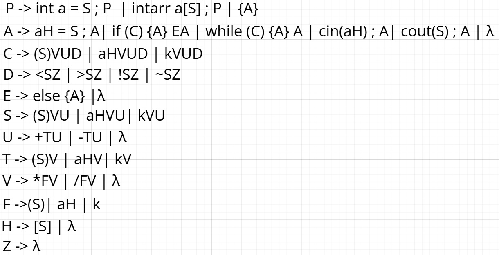

# Interpreter for custom Programming Language by Context-Free Grammar

| Path          | Purpose |
| ------------- | ------- |
| **`/theory`** | All reference material that formally defines the grammar (BNFs, transition table, rule generation and rpn generation tables). |
| **`/tests`**  | Language tests showing its capabilities |

## 🧠 Interpreter Structure

The interpreter is composed of **three main components**:
### 1. 🔍 Lexical Analysis
- Scans a line of input and its offset.
- Returns a single tokens.

### 2. 📐 Syntactic Analysis
- Based on the **LL(1) parsing** technique.
- Consists of two parallel components:
  - **LL(1) Parser** — Validates the token sequence against grammar rules.
  - **RPN Generator** — Builds a Reverse Polish Notation (RPN) representation during parsing.

### 3. ⚙️ RPN Executor
- Executes the previously generated RPN expression.
- Handles computation and control flow according to the language semantics.

